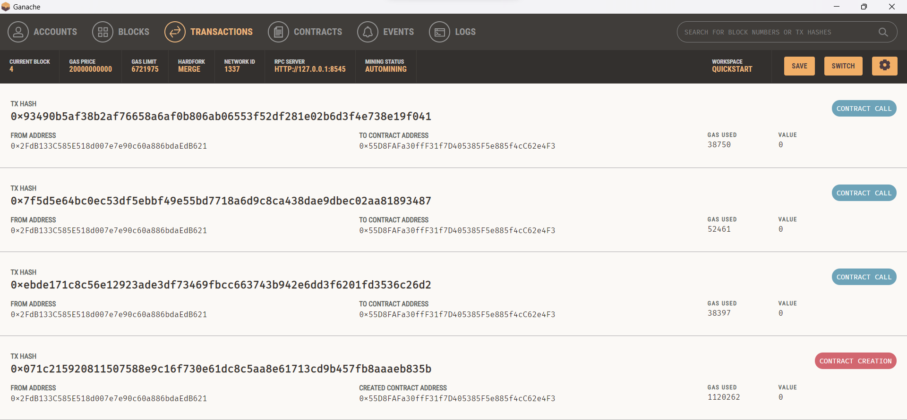
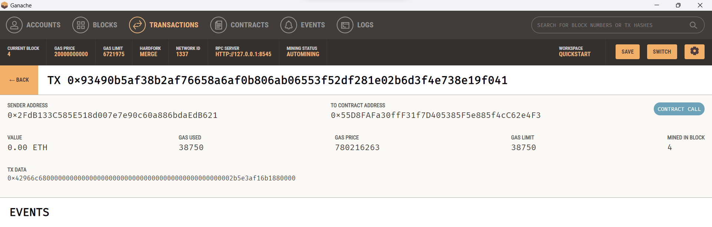
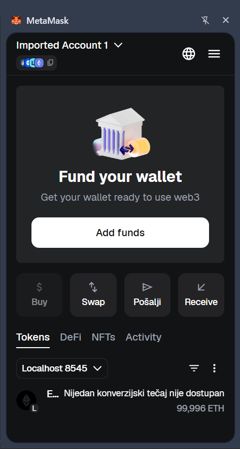

# Izvještaj o projektnom zadatku: Implementacija sustava tokena u Solidityju

1\. Uvod

Projektni zadatak u sklopu kolegija Informacijska sigurnost i blockchain tehnologije obuhvaća razvoj i testiranje jednostavnog sustava tokena temeljenog na pametnom ugovoru. Primarni cilj bio je primijeniti teoretska znanja o blockchain tehnologiji kroz praktičnu izradu funkcionalnog rješenja u programskom jeziku Solidity. Sustav je dizajniran da simulira osnovne operacije digitalne imovine, uključujući inicijalizaciju ponude, prijenos vrijednosti između korisnika te upravljanje ukupnom količinom tokena u optjecaju.

2\. Arhitektura i tehnološki okvir

Tehničko rješenje temelji se na suvremenim alatima za razvoj decentraliziranih aplikacija. Za pisanje pametnog ugovora korišten je Solidity (verzija 0.8.x), dok je razvojni proces olakšan upotrebom razvojnog okvira Hardhat. Lokalna blockchain mreža Ganache poslužila je kao kontrolirano okruženje za izvršavanje transakcija, a interakcija s ugovorom ostvarena je putem ethers.js biblioteke.

Struktura projekta podijeljena je na tri ključna segmenta:

-   **Contracts**: Sadrži izvorni kod pametnog ugovora.

-   **Scripts**: Obuhvaća automatizirane skripte za postavljanje (deploy) ugovora na mrežu te demonstraciju njegovih funkcija.

-   **Test**: Sadrži skupove automatiziranih testova koji osiguravaju ispravnost koda prije produkcije.

3\. Tehnička implementacija pametnog ugovora

Glavna komponenta sustava je ugovor pod nazivom **cToken**. On definira logiku upravljanja stanjima računa korisnika putem varijabli stanja kao što su naziv tokena, simbol, broj decimala i ukupna zaliha. Stanja pojedinih adresa pohranjena su u privatnom mapiranju (mapping), čime se osigurava integritet podataka.

### 3.1. Ključne funkcije i logika

Prilikom inicijalizacije ugovora koristi se konstruktor koji definira vlasnika (owner) te dodjeljuje cjelokupnu početnu zalihu tokena adresi koja je izvršila deploy. Time je ispunjen zahtjev za definiranjem fiksne količine tokena pri samom startu sustava.

Funkcionalnost prijenosa ostvarena je metodom `transfer`, koja provjerava posjeduje li pošiljatelj dovoljan iznos tokena te osigurava da primatelj nije nulta adresa. Za upravljanje monetarnom politikom tokena implementirane su funkcije `mint` i `burn`. One omogućuju povećanje ili smanjenje ukupne ponude, ali su strogo zaštićene modifikatorom `onlyOwner`, što sprječava neovlaštene korisnike u manipulaciji zalihama.

4\. Analiza rezultata i testiranje

Ispravnost implementacije potvrđena je kroz dva procesa: ručnu demonstraciju na Ganache mreži i automatizirano testiranje. Tijekom testiranja na lokalnoj mreži, uspješno su izvršene transakcije između vlasnika i testnih adresa, što je dokumentirano pripadajućim hashovima transakcija i promjenama u stanjima računa.

### 4.1. Rezultati testiranja

Automatizirani testovi obuhvatili su provjeru:

-   Uspješnog postavljanja ugovora s ispravnim parametrima.

-   Ispravnosti funkcija prijenosa i ažuriranja stanja (balance).

-   Sigurnosnih protokola koji onemogućuju ne-vlasnicima korištenje administrativnih funkcija.

Izvršavanjem naredbe `npx hardhat test`, potvrđeno je da sve kritične funkcije prolaze predviđene scenarije, čime je dokazana stabilnost i sigurnost rješenja.

### 4.2. Detalji izvršenih transakcija na Ganache mreži

Testiranje pametnog ugovora provedeno je na lokalnoj blockchain mreži pomoću alata Ganache,
dok su deploy i interakcije automatizirane korištenjem razvojnog okvira Hardhat i biblioteke ethers.js.

Tijekom demonstracije izvršene su sljedeće stvarne transakcije:

#### Deploy pametnog ugovora

- Contract adresa:  
  `0xcFcfbC3B1f8af089A247BCF496cda60378F2F324`

- Početno stanje:
  - Owner balance: 1000 tokena
  - Total supply: 1000 tokena

Ovom transakcijom kreiran je ugovor te je početna količina tokena dodijeljena vlasniku.

#### Mint transakcija (povećanje ponude)

- Hash transakcije:  
  `0x9ac7419ea58fb243687c1229bfabad6ea73a83ff7e7aa3a32f154b0ac5e4200d`

- Akcija: mint 200 tokena

- Stanje prije:
  - Owner: 1000
  - TotalSupply: 1000

- Stanje poslije:
  - Owner: 1200
  - TotalSupply: 1200

Ovom operacijom potvrđeno je ispravno povećanje ukupne ponude tokena.

#### Transfer transakcija (Owner → Addr1)

- Hash transakcije:  
  `0xd5a6c7454f6e8632c286c35cff239b4d039288d23f8cffde710fc4cbc411b04d`

- Iznos: 10 tokena

- Stanje prije:
  - Owner: 1200
  - Addr1: 0

- Stanje poslije:
  - Owner: 1190
  - Addr1: 10

Transakcija potvrđuje ispravno ažuriranje stanja obje adrese.

#### Burn transakcija (smanjenje ponude)

- Hash transakcije:  
  `0x937f4d4543ede2022c75a41dcbf8e8349dff8cab7cf9671fec4a0d7902216461`

- Akcija: burn 50 tokena

- Stanje prije:
  - Owner: 1190
  - TotalSupply: 1200

- Stanje poslije:
  - Owner: 1140
  - TotalSupply: 1150

Ovom operacijom potvrđeno je ispravno smanjenje ukupne ponude tokena.

Dobiveni rezultati jasno pokazuju da se sve funkcije pametnog ugovora izvršavaju očekivano te da se stanja računa i ukupna ponuda tokena ispravno ažuriraju nakon svake transakcije.

### Pregled izvršenih transakcija u Ganache sučelju

Slika prikazuje popis svih izvršenih transakcija tijekom testiranja pametnog ugovora,
uključujući deploy (contract creation) te pozive funkcija mint, transfer i burn.

Detalji jedne transakcije pokazuju potrošnju gasa, hash i ostale parametre:

### 4.3. Prikaz stanja računa u MetaMask novčaniku

Tijekom testiranja korišten je MetaMask novčanik za upravljanje lokalnim računima na Ganache mreži.

Nakon izvršavanja svih transakcija (deploy, mint, transfer i burn), vidljivo je da stanje računa više nije točno 100 ETH, već nešto manje (npr. 99.996 ETH).

Razlog tome je potrošnja **gas naknade** za svaku izvršenu transakciju.  
Svaka operacija na blockchainu (deploy ugovora ili poziv funkcije) zahtijeva plaćanje naknade u ETH-u, koja se koristi za pokrivanje troškova obrade transakcije.

Zbroj svih izvršenih transakcija rezultirao je malim smanjenjem početnog stanja, što je očekivano i predstavlja normalno ponašanje Ethereum mreže.

U nastavku je prikazan screenshot stanja računa u MetaMask novčaniku:

5\. Zaključak

Realizirani projektni zadatak u potpunosti zadovoljava sve postavljene tehničke zahtjeve. Implementirani pametni ugovor uspješno demonstrira temeljne koncepte blockchain tehnologije, uključujući decentralizirano upravljanje stanjima, sigurnosne restrikcije pristupa i transparentnost transakcija. Postavljena arhitektura pruža čvrst temelj za daljnje nadogradnje, poput implementacije punog ERC-20 standarda ili integracije s web sučeljem.

* * * * *

**Podaci o radu:**

-   **Predmet:** Informacijska sigurnost i blockchain tehnologije

-   **Ustanova:** FIDIT - Fakultet informatike i digitalnih tehnologija Rijeka

-   **Autor:** Tin Barbarić
